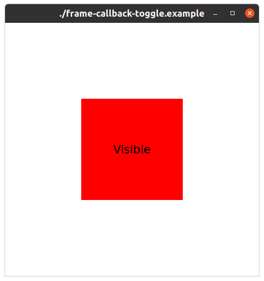
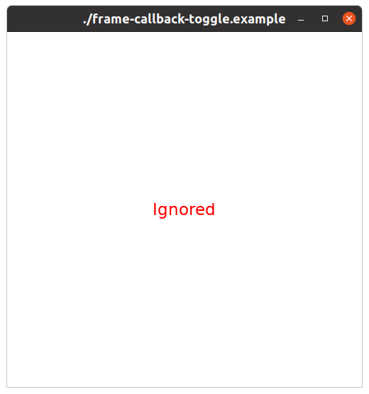

# Frame Callback Toggle Example

## Description

This example demonstrates how to use `Dali::FrameCallbackInterface` to safely modify an actor's properties from the update thread. Specifically, it shows how to periodically toggle an actor's "ignored" state, which controls its visibility and participation in hit-testing and rendering.

The application creates a red square (a `View` with a color visual) and two `TextLabel` instances ("Visible" and "Ignored"). A custom `FrameCallbackInterface` implementation, `IgnoredToggler`, is registered to be called every frame. This callback toggles the ignored state of the red square every 2 seconds. The text labels' visibility is also toggled accordingly to provide a clear visual indication of the red square's current state.

This example highlights the importance of using `UpdateProxy::SetIgnored` within the frame callback for thread-safe modifications, as directly setting actor properties from the update thread is not safe.

## Key Features

*   **FrameCallbackInterface**: Shows how to implement and register a custom frame callback.
*   **UpdateProxy**: Demonstrates the use of `UpdateProxy::SetIgnored` to safely modify actor properties from the update thread.
*   **Actor Ignored State**: Illustrates the effect of the "ignored" property on an actor's visibility and its children.
*   **Periodic Updates**: Uses a timer within the frame callback to perform actions at regular intervals.

## Controls

*   **Touch**: Touching anywhere on the screen will quit the application.
*   **Back Key**: Pressing the hardware back key will quit the application.
*   **Escape Key**: Pressing the escape key (if available, e.g., on a desktop build) will quit the application.

