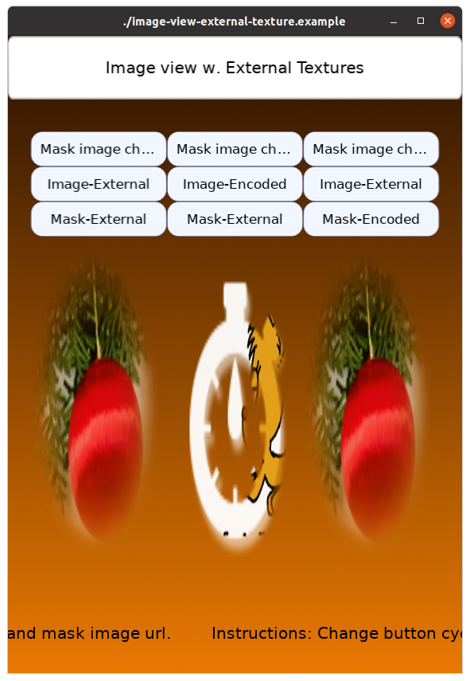

# Image View External Texture Test Example

This is a various test example for ExternalTexture and EncodedImageBuffer.

There are 3 types of images in the scene ; Regular Image / Animated Image (webp) / Sequencial Image.

Also, there are 3 types of image url ; Regular URL / ExternalTexture generated ImageUrl / EncodedImageBuffer generated ImageUrl.

 - First row buttons change the masking image url. (Include invalid url to check error handling.)
 - Second row buttons change the image type.
 - Third row buttons change the masking image type.

We can check whether some pair of case didn't work properly or not.

