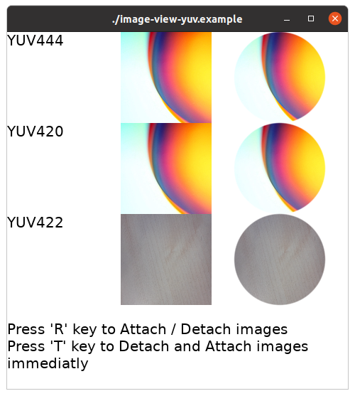

# Image View with YUV plane loading Test Example

## Overview

Test application that YUV format jpg images load with 3-planes and combine the result at GPU time.

Basically, jpg image loaded by single buffer.
But if we want to reduce buffer's memory, we can turn on below environments and load YUV images
as each planes.

```shell
$ export DALI_LOAD_IMAGE_YUV_PLANES=1
$ export DALI_ENABLE_DECODE_JPEG_TO_YUV_444=0 # Do not use YUV plane loading for YUV444 format
$ export DALI_ENABLE_DECODE_JPEG_TO_YUV_420=1 # Let we use YUV plane loading for YUV420 format
```
It will be helpful when we want to reduce GPU memory for YUV format images.

We can also test that YUV loading successed when `DevelImageVisual::Property::FAST_TRACK_UPLOADING` is true.

For this demo application, we turn on every YUV format load as 3-planes.

@TODO : Need to collect more kinds of YUV!
        Required resources : GRAY, YUV_440, YUV_411, YUV_441


Press `R` key to test Attach / Detach.

Press `T` key to test Detach and Attach immediatly. (Test wether the YUV result cached or not.)



## Developer Note

If you want to see that we upload images 3 planes,

Please build `dali-core`, `dali-adaptor`, `dali-toolkit` and `dali-demo` as `Debug` option, include `-DENABLE_TRACE=ON` options.

```shell
$ cd ~/dali-core/build/tizen/
$ cmake -DCMAKE_BUILD_TYPE=Debug -DENABLE_TRACE=ON
$ make install -j9
... And so on to dali-adaptor, dali-toolkit, dali-demo.
```

After build finished, set environment values like below

```shell
$ export DALI_PRINT_LOG_LEVEL=0
$ export DALI_TRACE_ENABLE_PRINT_LOG=1
$ export DALI_TRACE_IMAGE_PERFORMANCE_MARKER=1
```
Check that `b:3` print well both `DALI_IMAGE_LOADING_TASK` and `DALI_IMAGE_FAST_TRACK_UPLOADING_TASK` case.

`b:` means the number of bitmaps what we loaded.

```shell
$ ./image-view-yuv.example
...
$ DEBUG: DALI: trace-manager-impl-generic.cpp: LogContext(84) > BEGIN: DALI_IMAGE_LOADING_TASK [u:.../gallery-small-1.jpg]
$ DEBUG: DALI: trace-manager-impl-generic.cpp: LogContext(88) > END: DALI_IMAGE_LOADING_TASK [d:0.499ms m:0 i:0 b:3 s:128x128 p:1 u:.../gallery-small-1.jpg]
$ DEBUG: DALI: trace-manager-impl-generic.cpp: LogContext(84) > BEGIN: DALI_IMAGE_FAST_TRACK_UPLOADING_TASK [u:.../gallery-small-1.jpg]
$ DEBUG: DALI: trace-manager-impl-generic.cpp: LogContext(88) > END: DALI_IMAGE_FAST_TRACK_UPLOADING_TASK [d:0.267ms b:3 s:128x128 p:1 u:.../gallery-small-1.jpg]
```

If you want to check YUV image cached or not, set `LOG_TEXTURE_MANAGER` environment value as `3`, and see `RequestLoadInternal` logs.

```shell
$ export LOG_TEXTURE_MANAGER=3
$ ./image-view-yuv.example
...
$ INFO: DALI: texture-manager-impl.cpp: RequestLoadInternal(563) > TextureManager::RequestLoad( url=/home/hpichu/work/dali-env/opt/share/com.samsung.dali-demo/res/images/gallery-small-1.jpg size=0x0 observer=0x5583e2c820f8 ) New texture, cacheIndex:0, textureId=0, maskTextureId=-1, frameindex=0 orientCorrect=0 premultiply=1 # Request new loading
...
$ INFO: DALI: texture-manager-impl.cpp: RequestLoadInternal(552) > TextureManager::RequestLoad( url=/home/hpichu/work/dali-env/opt/share/com.samsung.dali-demo/res/images/gallery-small-1.jpg size=0x0 observer=0x5583e2c820f8 ) Using cached texture id@0, textureId=0, maskTextureId=-1, prevTextureId=-1, frameindex=0, orientCorrect=0, premultiplied=1, refCount=2 # Use cached texture

```