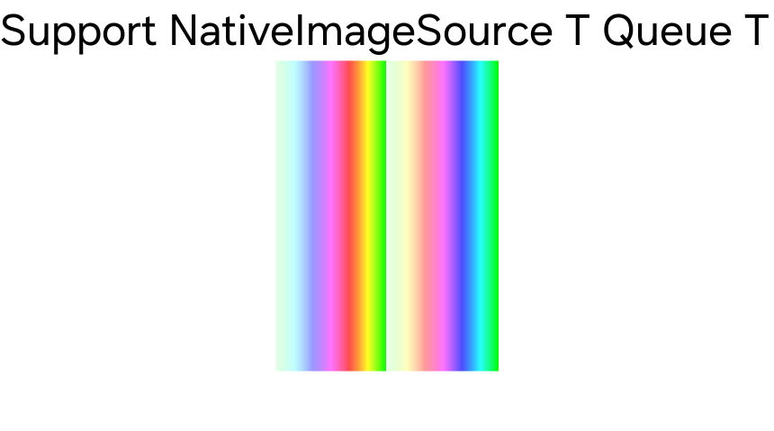

# Native Image Source Queue Example

Test for `NativeImage` and `NativeImageQueue` works well.

Left half is `NativeImage` with static image.
Right half is `NativeImageQueue` with dynamic image.

This demo test each image buffer write at custom thread, and render result applied well.

Press 1 to add BackgroundBlur effected view on the scene.
Press 2 to reset the `NativeImage` image.

> Warning : This demo application works only for Tizen target.

