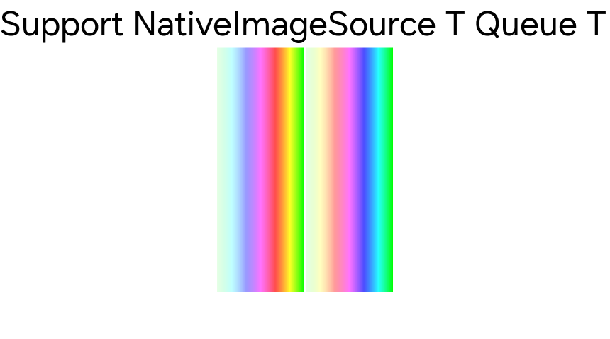

# Native Image Source Queue Example

Test for `NativeImageSource` and `NativeImageSourceQueue` works well.

Left half is `NativeImageSource` with static image.
Right half is `NativeImageSourceQueue` with dynamic image.

This demo test each image buffer write at custom thread, and render result applied well.

> Warning : This demo application works only for Tizen target.

