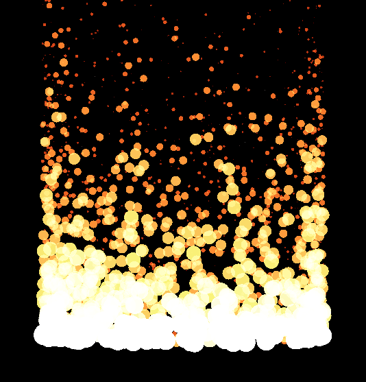
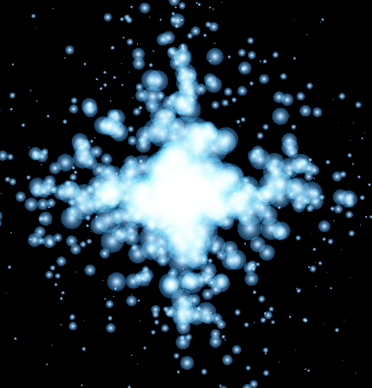
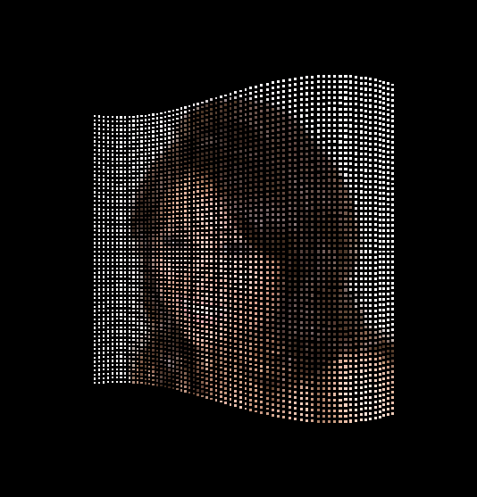

Particles System Example
========================

This example shows how the Particle system can be used.

It shows three effects:

* <b>Fire Effect</b>:

  This is a simple effect that shows fire particles rising from the center of the window.

  

* <b>Sparkle Effect</b>:

  This shows multiple sized particles starting at the center of the window and going in all directions.

  

* <b>Image Source Effect</b>:

  This takes an image source and creates particles from that image and shows them waving.

  

By tapping the screen, you can move between one effect to the next.
You can also press any key to move to the next effect apart from the ESC or Back keys which will exit the application.