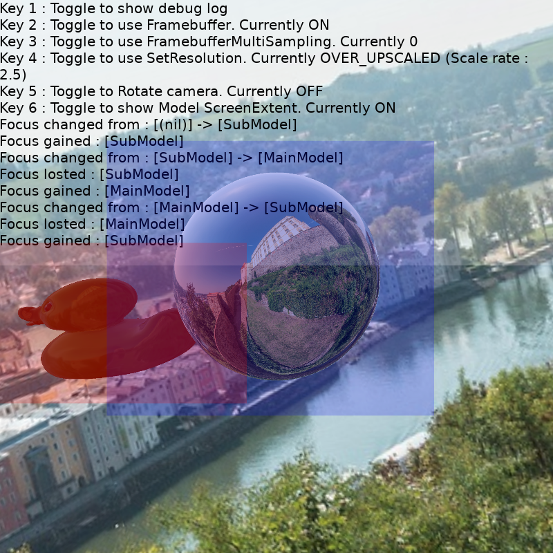

# Scene View Test Example

This is a various test example for SceneView and Model API in the DALi Scene3D library.

 - Use Framebuffer instead of direct rendering
 - Framebuffer multi samping level (Works only Framebuffer used)
 - Resolution of target (Works only Framebuffer used)
 - Screen extents calculation and show the result
 - Focus change by keyboard + touch
 - Change material property

Please update this note if you add some more test cases.

