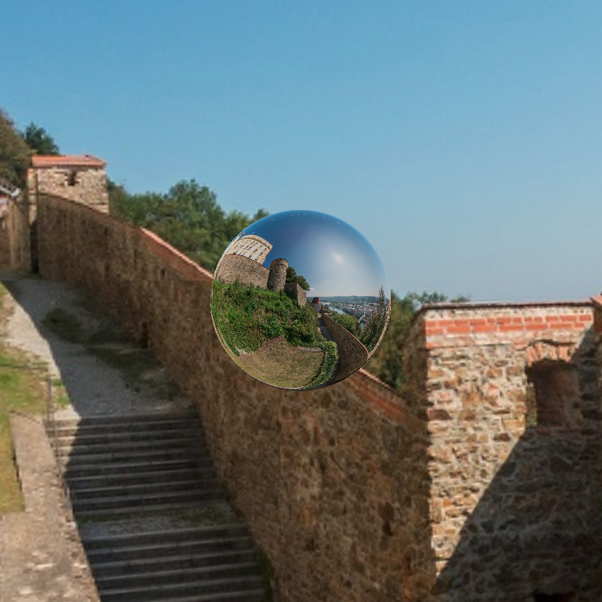

# Scene View Example

This is a basic example showing how to use a SceneView and a Model in the Scene3D library.
It also shows how an enviroment map can be loaded into the scene view and how to set the image-based-light source on the model.

The setup also shows how to do a rotation animation around the model.

