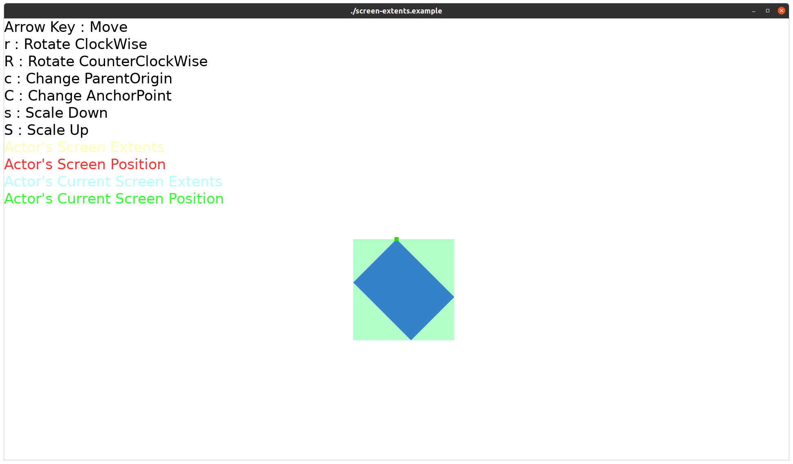

# Screen Extents Example

This example demonstrates how to calculate and visualize an actor's screen position and extents in the DALi framework.

## Overview

The Screen Extents Example helps you visually understand how an actor is positioned and how its size is calculated on the screen. You can see the real-time screen coordinates and bounding box of an actor with various transformations (position, rotation, scale) applied.

## Key Features

### Actor Configuration
- **Size**: 400x300 pixel blue control
- **Scale**: 0.5x scaling applied
- **Rotation**: 45-degree rotation around Z-axis
- **Parent Origin**: Center
- **Anchor Point**: Top-left

### Screen Coordinate Calculation
- `CalculateScreenPosition()`: Calculates the absolute screen position of the actor
- `CalculateScreenExtents()`: Calculates the screen bounding box of the actor
- `CalculateCurrentScreenExtents()`: Calculates the current frame's screen extents

### Visual Markers
- **Yellow semi-transparent rectangle**: Shows the actor's screen extents
- **Red dot**: Shows the actor's screen position
- **Cyan semi-transparent rectangle**: Shows the current frame's screen extents
- **Green dot**: Shows the current frame's screen position

### Keyboard Interaction
- **Arrow Keys**: Move actor position
- **r/R**: Rotate around Z-axis (counter-clockwise/clockwise)
- **c/C**: Cycle through parent origins (9 positions)
- **s/S**: Adjust scale (zoom out/zoom in)

## Core Concepts

### Parent Origin and Anchor Point
The example supports 9 standard positions:
- `TOP_LEFT`, `TOP_CENTER`, `TOP_RIGHT`
- `CENTER_LEFT`, `CENTER`, `CENTER_RIGHT`
- `BOTTOM_LEFT`, `BOTTOM_CENTER`, `BOTTOM_RIGHT`

**Parent Origin**: The reference point within the parent actor where the child actor is positioned
**Anchor Point**: The reference point within the actor itself for positioning

### Screen Coordinates vs Current Coordinates
- **Screen Coordinates**: Final absolute coordinates on the rendered screen
- **Current Coordinates**: Coordinates in the current frame (e.g., during animation states)

## Usage

1. Run the example to see a blue control with visual markers
2. Use keyboard controls to modify the actor properties
3. Observe how the markers update to show the calculated screen positions and extents
4. Touch the screen to exit the application

## Technical Details

The example demonstrates the use of:
- `Dali::DevelActor::CalculateScreenPosition()` for position calculation
- `Dali::DevelActor::CalculateScreenExtents()` for bounds calculation
- `Dali::DevelActor::CalculateCurrentScreenExtents()` for current frame bounds
- Real-time property updates and visual feedback

This example is particularly useful for understanding UI layout, touch event handling, and coordinate system transformations in DALi applications.
